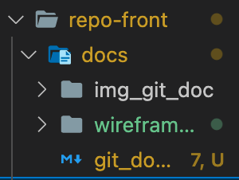
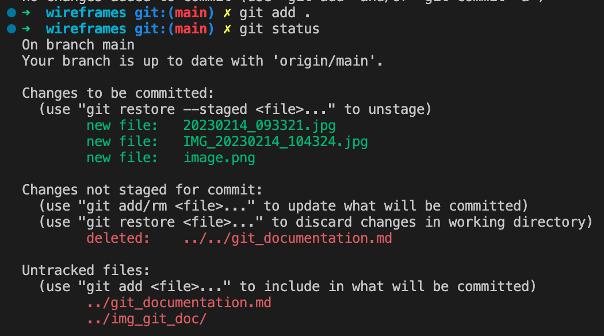
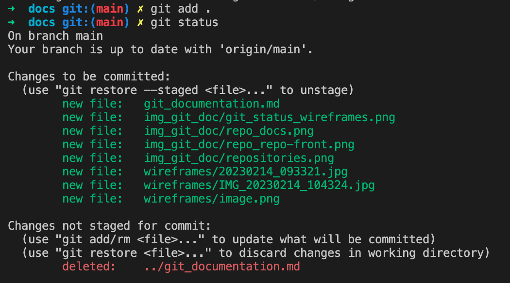

# Guide Git

Git est un système de gestion de code permettant le versionning de nos fichiers et donc de notre projet.

En français?

Imaginons que nous voulons créer une nouvelle voiture, la Allint Car permettant de ne plus jamais être allergiques
aux bouchons et autres mauvais conducteurs. Cette voiture devra être parfaite pour nos clients, on ne peut pas se
permettre de leur vendre une caisse à savon, puis une caisse à savon avec un moteur, etc, etc jusqu'à arriver 30 ans
plus tard avec une voiture volante et leur dire "Voila, c'est cette voiture là qu'on avait en tête au départ".
Pour livrer un produit fini, il va falloir prototyper.

Mais du coup Jamy, quand est ce que je sais quand mon prototype est terminé et qu'il faut en attaquer un autre?

Et bien je vais te répondre Fred. Pour un objet physique tel que notre voiture, nous pouvons nous dire que l'on
va créer un nouveau prototype à chaque nouvelle fonctionnalité ou évolution cosmétique de la voiture.
Nous aurons donc: AllintCar V1, AllintCar V2, AllintCar V3, AllintCar Vfinale, AllintCar Vfinale2, etc....
Ce qu'on a fait ici, c'est du versionning.

Ça sera super pour remplir notre futur musée automobile quand on sera super riche, mais ça peut vite devenir assez
encombrant, surtout si on décide de faire deux protos avec la forme des phares pour seul changement.

Nous avons l'avantage de travailler dans un environnement virtuel. Mais on est pas des Webdesigners (balle perdue),
On ne va pas creer indexV1.js, indexV2.js + styles.css, indexV1finalementParcequeCetaitMieux.js + stylesV2.css, etc....

Nous avons GIT.

Git va nous permettre d'avoir ces fameuses versions fixées à un moment donné de notre projet, tout en continuant
de pouvoir travailler dessus. L'avantage? Si demain nous décidons de mettre notre scan en place et que cette fonctionnalité
casse l'outil recherche ou la fonctionnalité Connexion, nous pouvons revenir à la version d'avant le scan en allant
directement sur le commit juste avant l'implementation de cette fonctionnalité et repartir de cette base.

Faire souvent des commits en indiquant ce que l'on a mis dedans est donc promordial pour pouvoir faire cela,
encore plus en travail d'équipe où chacun peut casser le code de l'autre sans le vouloir.

Il est donc important d'avoir une convention entre nous pour éviter de nous perdre.

## Commandes git utiles

Pour pouvoir utiliser git

Les commandes suivantes auront un résultat différent en fonction de l'endroit où je les tapperai (le dossier courant).

Soit l'arborescence suivante:  
  

Si je vois dans ma console:  
  
Le **dossier courant** est `repo-front`.

Si je vois dans ma console:  
  
Le **dossier courant** est `repo-front/docs`.

 Pendant le projet:

### `git status`

Cette commande doit être la commande reflexe. Elle permet de connaitre l'état de votre projet vis à vis de git.  
Savoir dans quel état est notre git est très utile. Avec la commande suivante (`git add`), vous verrez que l'on peut ajouter un ou
plusieurs dossiers. Savoir quel fichier ou dossier est en cours de "sauvegarde", quel dossier est suvi, quel dossier a été modifié
peut donc vous sauver en évitant d'oublier d'inclure un fichier dans votre commit et donc dans le push.  

### `git add`
  
  Cette commande permet d'ajouter des fichiers / dossiers dans le colis. La commande la plus commune est `git add .`,
Cela permet d'ajouter TOUTES les modifications depuis le dernier `git push`. Ce la peut être pratique si l'on a travailler que sur un
seul fichier ou une portion de code. En revanche, si plusieurs fichiers ont été modifiés et que l'on ne souhaite pas les integrer
au commit (ex. Je veux faire un commit traitant uniquement de la documentation mais j'ai aussi modifié mon router), alors la commande
à faire est `git add nomDuFichier`.
Si vous désirez ajouter tout un dossier et son contenu (ex. Tous les controllers du dossier repo-back/controller/mainController/),
la commande à faire sera `git add dossier/`.  
Pourquoi pas `.` et pas `*` ?  
Bonne question Jamy, on aurait pu tout a faire faire `git add *` car `*` signifie *All*, donc ici *'ajouter TOUT'*.  
Les deux commandes se valent si on est situé au fichier racine `repo-front`, car `.` signifie *"où je me trouve"*. La commande `git add .` peut donc
être traduite comme *"ajoute toutes les modifications depuis le dernier push du dossier dans lequel je me trouve"*, si on est situé
au fichier racine, cela concernera toute notre application, si on est dans un fichier en particulier comme `repo-front/docs`, la commande `git add .` ajoutera tout ce qui se trouve dans ce dossier uniquement.  
Prenons l'exemple suivant:  
Nous voyeageons entre le dossier `docs` et le dossier `wireframes` pendant notre projet. Par reflexe, nous voulons ajouter les fichiers modifiés avec le fameux `git add .` (*ça commence à entrer pas vrai?*), quelles sont les différences selon l'endroit où l'on se trouve dans la console?  

Analysons les résultats avec un petit git status:  

Ce qui est dit ici:  
* Trois fichiers sont nouveaux et ont été ajoutés à la préparation du commit (*spoiler alert: les trois fichiers présents dans le fichier wireframes*).
* Un fichier a été détruit depuis le dernier push(`git_documentation.md`), et celui-ci se trouvait deux niveaux au dessus du dossier courant ( le fameux `../../`).
* Deux autres fichiers sont apparus depuis le dernier push, ils sont tous les deux situés un niveau au dessus du dossier courant (puisque `../`) mais je sais pas trop s'ils sont nouveaux ou modifiés parce que comme c'est pas dans le dossier courant c'est pas trop mes oignons, en tout cas ils sont là (*Si on regarde bien on voit le fichier `git_documentation.md` et on comprend qu'il n'a pas été supprimé mais juste déplacé*).

* `git commit -m "Le titre de mon commit"` :

* `git push` :

## Convention des commits

Avoir un historique des "sauvegardes" de notre projet peut être utile
